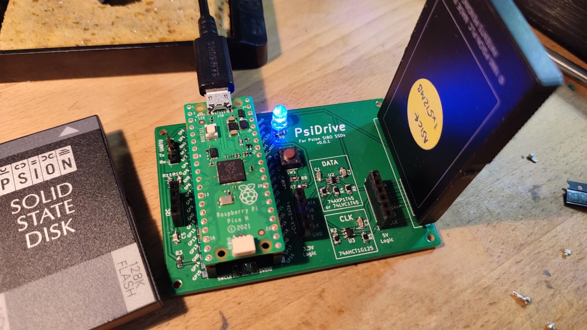
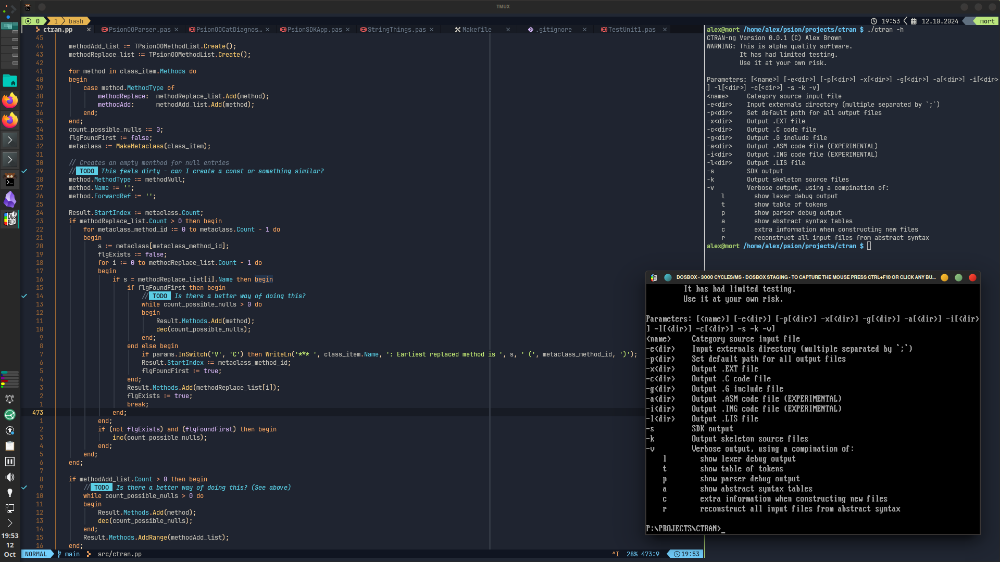

= The Last Psion

I'm Alex and I have a PDA problem.

In 2018, after 16 years of using various Psion portables, I decided to try my hand at developing hardware and software for my beloved Series 3c to help me with journalling and creative writing.

6 years and repeated sidequests later, I've ended up doing a _lot_ of research into the SIBO/EPOC16 platform, and done my best to document it when I can. I've also nudged former developers into open sourcing their old Psion apps.

My current main projects are:

* https://github.com/thelastpsion/psidrive-testboard[PsiDrive], an RP2040-based USB drive for SIBO SSDs.
* Rewriting the Psion SIBO (16-bit 8086) C SDK, including updating the docs (with AsciiDoc) and rewriting the original DOS tools as FOSS apps. I'm currently using Free Pascal to create a drop-in replacement for https://github.com/thelastpsion/ctran[CTRAN], the Psion OO C preprocessor. (I want to eventually write a new compiler targeting EPOC16. Eventually.)
* Anything else that tickles my bouncy brain.

Outside of retrocomputing, I'm your common-or-garden British nerd. I'm a Linux user - mostly Arch, but I dabble with others. I also like a bit of Haiku OS and I'm planning on giving FreeBSD a go soon.

I used to be a senior computer monkey, specialising in on-prem SME infrastructure (I lament the loss of vSphere). Now I train others to become computer monkeys, for better or worse. As a result, sometimes you'll see me wrestling with old Cisco ASAs, Ubiquiti APs, or modded kit running OpenWrt.

Generally, I like making things do stuff, especially if it's stuff that the thing wasn't originally designed to do.

